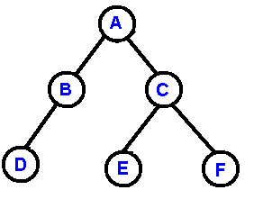
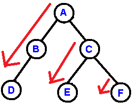

# Reconstruct Binary Tree
This is to re-construct binary tree based on pre-order and in-order squences, without recursion. Given the binary below:


The pre-order sequence is: A B D C E F

And the in-order sequence is: D B A E C F

In fact, the pre-order sequence is just the order shown below. It follows the red arrows one by one.


Given the above idea, we could re-construct the binary with out recursion.

Leetcode to try it: https://leetcode.com/problems/construct-binary-tree-from-preorder-and-inorder-traversal/

```cpp
/**
 * Definition for a binary tree node.
 * struct TreeNode {
 *     int val;
 *     TreeNode *left;
 *     TreeNode *right;
 *     TreeNode() : val(0), left(nullptr), right(nullptr) {}
 *     TreeNode(int x) : val(x), left(nullptr), right(nullptr) {}
 *     TreeNode(int x, TreeNode *left, TreeNode *right) : val(x), left(left), right(right) {}
 * };
 */
class Solution {
    TreeNode* buildTreeInner(vector<int>& prorder, int prStt, int prEnd,
                             vector<int>& inorder, int inStt, int inEnd){
        if(prStt >= prEnd) return NULL;
        if(prStt + 1 == prEnd) return new TreeNode(prorder[prStt]);
        int rootVal = prorder[prStt];
        int rootValIdx = inStt;
        for(; rootValIdx < inEnd; rootValIdx++){
            if(inorder[rootValIdx] == rootVal) break;
        }
        int leftCnt = rootValIdx - inStt;
        int rigtCnt = inEnd - rootValIdx - 1;
        TreeNode* pRoot = new TreeNode(rootVal);
        pRoot -> left  = buildTreeInner(prorder, prStt + 1, prStt + 1 + leftCnt, inorder, inStt, rootValIdx);
        pRoot -> right = buildTreeInner(prorder, prEnd - rigtCnt, prEnd, inorder, rootValIdx + 1, inEnd);
        return pRoot;
    }
    
    int findAncestor(const vector<TreeNode*> & stack, const vector<int>& inorder, int& in_idx){
        int res = -1;
        for(int idx = stack.size() - 1; idx >= 0; idx--) {
            if(stack[idx] -> val == inorder[in_idx]) {
                res = idx;
                in_idx++;
            };
        }
        return res;
    }
    
public:
    TreeNode* buildTree(vector<int>& preorder, vector<int>& inorder) {
        int len = preorder.size();
        // return buildTreeInner(preorder, 0, len, inorder, 0, len);
        vector<TreeNode*> stack;
        int i1 = 0; // preorder index
        int i2 = 0; // inorder index
        TreeNode* p4r = NULL; // pointer for right child
        while(i1 < len) {
            TreeNode* p4l = NULL; // pointer for left child
            while(i1 < len) {
                TreeNode* p = new TreeNode(preorder[i1]);
                if(p4r) {p4r -> right = p; p4r = NULL; }
                if(p4l) {p4l -> left = p; }
                p4l = p;
                stack.push_back(p);
                if(preorder[i1] == inorder[i2]) break;
                else i1++;
            }
            //cout<<"i1:"<<i1<<"; i2:"<<i2<<"; ";
            i1++, i2++;
            if(i1 >= len) break;
            int ancestor_idx = findAncestor(stack, inorder, i2);
            //cout<<"ancestor_idx:"<<ancestor_idx<<endl;
            if(ancestor_idx >= 0){
                stack.resize(ancestor_idx + 1);
            }
            p4r = stack[stack.size() - 1];
        }//while
        return stack[0];
    }//buildTree()
};
```
