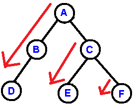
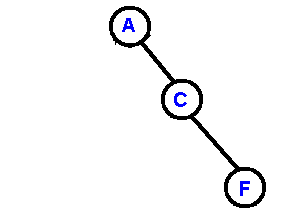

# Reconstruct Binary Tree
This is to re-construct binary tree based on pre-order and in-order squences, without recursion. Given the binary below:


The pre-order sequence is: A B D C E F

And the in-order sequence is: D B A E C F

In fact, the pre-order sequence is just the order shown below. It follows the red arrows one by one.



Given the above idea, we could re-construct the binary with out recursion. Of course, we need to use a stack to store some node pointers.

First iteration, create nodes A B D;

Second iteration, create nodes C E;

Third iteration, create node F.

Each iteration will create node and its left child. This should be easy. The difficult point is, how to know and handle the related right child. Please see the soure code for detailed manipulation.

Leetcode to try it: https://leetcode.com/problems/construct-binary-tree-from-preorder-and-inorder-traversal/

```cpp
/**
 * Definition for a binary tree node.
 * struct TreeNode {
 *     int val;
 *     TreeNode *left;
 *     TreeNode *right;
 *     TreeNode() : val(0), left(nullptr), right(nullptr) {}
 *     TreeNode(int x) : val(x), left(nullptr), right(nullptr) {}
 *     TreeNode(int x, TreeNode *left, TreeNode *right) : val(x), left(left), right(right) {}
 * };
 */
class Solution {
    int findAncestor(const vector<TreeNode*> & stack, const vector<int>& inorder, int& in_idx){
        int res = -1;
        for(int idx = stack.size() - 1; idx >= 0; idx--) {
            if(stack[idx] -> val == inorder[in_idx]) {
                res = idx;
                in_idx++;
            };
        }
        return res;
    }
    
public:
    TreeNode* buildTree(vector<int>& preorder, vector<int>& inorder) {
        int len = preorder.size();
        vector<TreeNode*> stack;
        int i1 = 0; // preorder index
        int i2 = 0; // inorder index
        TreeNode* p4r = NULL; // pointer for right child
        while(i1 < len) {     // each while loop is just one iteration mentioned above.
            TreeNode* p4l = NULL; // pointer for left child
            while(i1 < len) {
                TreeNode* p = new TreeNode(preorder[i1]);
                if(p4r) {p4r -> right = p; p4r = NULL; }
                if(p4l) {p4l -> left = p; }
                p4l = p;
                stack.push_back(p);
                if(preorder[i1] == inorder[i2]) break;
                else i1++;
            }
            i1++, i2++;
            if(i1 >= len) break;
            int ancestor_idx = findAncestor(stack, inorder, i2);
            if(ancestor_idx >= 0){
                stack.resize(ancestor_idx + 1);
            }
            p4r = stack[stack.size() - 1];
        }//while
        return stack[0];
    }//buildTree()
};
```

## Further improvement
If the binary only contains right child (except for the root node):



then the pre-order and in-order will be the same. For example, for the above tree, the pre-order and in-order are both "A E F".

In this case, the right-child manipulation will be O(n\*n) time complexity. It seems we can improve for this scenario.
